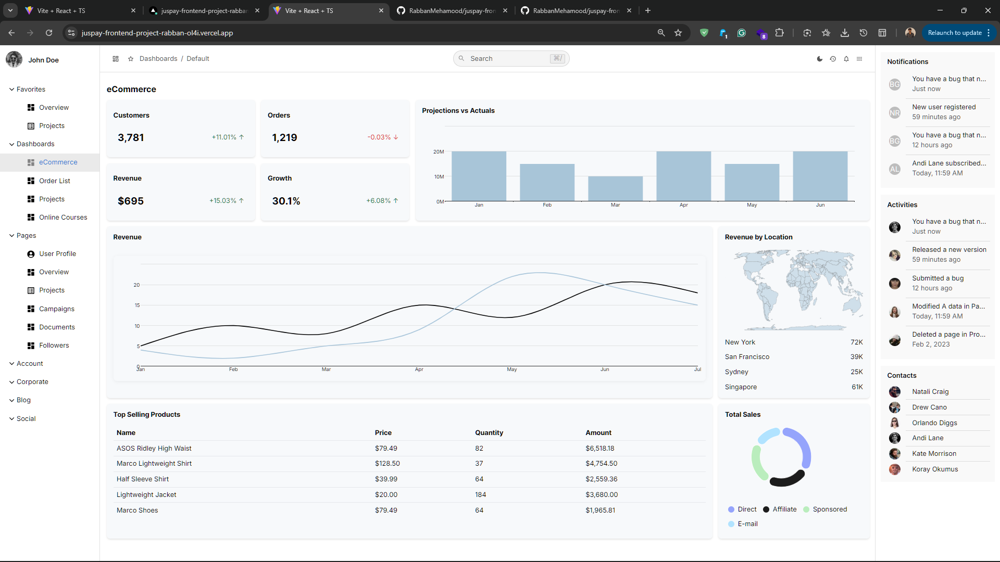

# Modern Dashboard Web App Created Using React + TypeScript + Vite + MUI

## Live Demo (Hosted Live Website Link): 
- https://juspay-frontend-project-rabban-ol4i.vercel.app/




## Tech Stack
**React - TypeScript - MUI - MUI X Charts - Tailwind** 

## Prerequisites
- **Node.js LTS**

- **pnpm | npm | yarn**

## Local Setup

```bash
git clone https://github.com/RabbanMehamood/juspay-frontend-project-rabban.git
cd juspay-frontend-project-rabban.git
npm i
npm run dev   # or: npm start
```

## Build

```bash
npm run build
npm run preview
```

## Deployment

- Connected to Vercel. Every push to main auto‑deploys a preview; merges to main deploy to production.

## Design Notes

Topbar with themed icons and translucent search, matching Figma header.

- Right drawer: Notifications, Activities, Contacts with dotted borders.

- Orders table: toolbar (Add/Filter/Sort), search on right, compact rows, themed dividers, centered pagination.

- Charts: stacked bar with slim rounded bars; donut with custom legend and tooltip.

Challenges & Improvements

- Matching MUI X rounded bars required CSS var overrides; solved with --ChartsBar-borderRadius.

- Ensured pixel‑perfect spacing via colgroup widths and action.* tokens.

- Future: extract UI tokens, add tests, integrate API.

## Scripts

```tex
dev – npm run dev

build – production build

preview – preview build locally

lint – run ESLint
```


`License`
MIT
